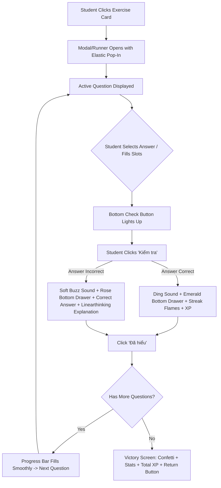

# PRD — Gamified Bite-Sized Exercises Module (Duolingo-Style)

## 1. Executive Summary & Problem Statement

### 1.1 The Problem

In traditional IELTS preparation platforms, homework and practice exercises are delivered as static PDFs or intimidating 40-question mock tests. This format causes high cognitive resistance, student procrastination, and drop-off—especially for high school and university students with limited study windows during their daily commute or study breaks.

### 1.2 The Solution

Deliver a **Duolingo-style, gamified bite-sized exercise experience** directly inside the IELTS Hồ Thành LMS Student Portal.

- **Duration**: 3 to 5 minutes per lesson (5–7 questions per session).
- **Instant Dopamine Loop**: Continuous tactile interaction (_Tap $\to$ Slot $\to$ Check $\to$ Celebrate $\to$ Continue_).
- **Target Question Types**:
  1. **Single Choice** (1 correct answer, 3D card press, keyboard shortcuts 1–4).
  2. **Multiple Choice** (Multiple correct answers with live selection counter).
  3. **Word Bank Gap Fill** (Interactive word chips with **0px layout shift** placeholders).
- **Academic Rigor**: Pairs gamified mechanics (XP, combo streaks, Web Audio feedback) with IELTS Hồ Thành's signature **Linearthinking explanation engine** on incorrect answers.

### 1.3 🚨 Hard Constraint: 100% Frontend UI/UX — Zero Backend Code

- Implemented entirely within the modern React 18 + TypeScript + Tailwind CSS architecture.
- Schema-driven via TypeScript interfaces (`GamifiedExerciseLesson`, `GamifiedQuestion`).
- Client-side persistence with `localStorage` (saved streaks, XP, lesson completion).
- Sound synthesis powered by native browser **Web Audio API** (0KB external audio assets).

---

## 2. Personas & User Journeys

| Persona                                        | Role & Demographics                                                                   | Mental Model & Core Pain Point                                                                                                                                                        |
| :--------------------------------------------- | :------------------------------------------------------------------------------------ | :------------------------------------------------------------------------------------------------------------------------------------------------------------------------------------ |
| **Hoàng (IELTS Student - Band 5.5 $\to$ 6.5)** | 19 years old, university sophomore. Studious but easily overwhelmed by lengthy tests. | "Sau 8 tiếng ở trường, mở đề IELTS 40 câu làm tôi rất nản. Tôi chỉ muốn tranh thủ 5 phút giải lao làm vài câu từ vựng hoặc cấu trúc câu vui vẻ, bấm nút nảy sướng tay như chơi game." |
| **Thầy Thành (Academic Director)**             | Head of IELTS Hồ Thành pedagogy.                                                      | "Game hóa không được làm loãng tính học thuật. Mỗi lần học viên chọn sai, hệ thống phải giải thích rõ ràng theo tư duy cấu trúc Linearthinking thay vì chỉ báo Đúng/Sai hời hợt."     |
| **Cô Linh (Teaching Assistant)**               | Manages daily homework reminders.                                                     | "Cần học sinh duy trì thói quen luyện tập mỗi ngày. Streak ngọn lửa và điểm XP thưởng là động lực tuyệt vời để các em không bỏ bài."                                                  |

---

## 3. The 3 Core Question Types & Interaction Specs

### 3.1 Single Choice (Chọn 1 đáp án đúng)

- **Use Case**: Collocations, vocabulary definitions in context, single-answer reading comprehension.
- **Layout**: Stack of 3–4 interactive 3D choice cards (`card-duo-choice`).
- **Tactile Interactions**:
  - **Click/Tap**: Card compresses slightly (`translate-y-1`), border turns Primary Red (`border-red-500 bg-red-50/70 text-red-800`), radio indicator ticks active.
  - **Keyboard Shortcuts**: Keys `1`, `2`, `3`, `4` or `A`, `B`, `C`, `D` instantly select corresponding card.
  - **Validation Activation**: Immediately enables the bottom "Kiểm tra" (Check) button.

### 3.2 Multiple Choice (Chọn nhiều đáp án đúng)

- **Use Case**: Multi-answer IELTS Reading/Listening tasks (e.g. _"Which TWO factors are mentioned?"_), grammatical error hunting.
- **Layout**: Multi-select cards with rounded checkboxes and an inline counter badge (e.g. `Đã chọn: 2/2 mục`).
- **Tactile Interactions**:
  - Tapping toggles selection.
  - Check button enables as soon as at least 1 item is selected (or when target count is reached).
  - Smooth SVG checkmark pop animation upon selection.

### 3.3 Word Bank Gap Fill (Ngân hàng từ điền khuyết)

- **Use Case**: Sentence structure drills, connecting ideas, summary completions.
- **Layout**:
  - **Top Area (Sentence Canvas)**: Text string with interactive blank slots (`[blank_1]`, `[blank_2]`).
  - **Bottom Area (Word Pool)**: A randomized bank of word chips (including correct words and distractors).
- **Tactile Interactions & Invariants**:
  - **Placing Word**: Tapping a word chip in the pool moves it into the first available empty slot in the sentence.
  - **Returning Word**: Tapping a filled word chip inside a slot immediately returns it back to the pool.
  - **🛡️ ZERO LAYOUT SHIFT (0px Shift)**: When a word chip is placed onto a slot, its original space in the pool is preserved with an **Empty Placeholder** (`border-2 border-dashed border-slate-200 bg-slate-100/60 text-transparent pointer-events-none`). Surrounding word chips **never jump or reflow**.

---

## 4. Gamified Loop & Micro-Interactions



### 4.1 Top Bar Gamified Elements

- **Exit Button (`X`)**: Safety dialog on click (_"Bạn có chắc muốn tạm dừng? Tiến độ câu hỏi bài này sẽ không được lưu."_).
- **Progress Bar**: Elastic filling animation (`cubic-bezier(0.34, 1.56, 0.64, 1)`), shiny glass highlight on top, emerald gradient.
- **Streak Counter (🔥)**: Increments with consecutive correct answers. Bounces excitedly at combo $\ge 3$.
- **Life/Shield Counter (❤️)**: Display mode configurable (3 lives or relaxed practice mode).
- **Sound Effect Toggle (🔊)**: One-click mute for studying in public or quiet libraries.

### 4.2 The 3-State Bottom Feedback Drawer

Fixed bottom bar (`fixed bottom-0 left-0 right-0 z-30`):

1. **Idle State**:
   - Clean white background (`bg-white border-t border-slate-200`).
   - 3D Check Button disabled with tactile inset shadow when unselected; lights up brand crimson when ready.
2. **Success State (`correct`)**:
   - Animated slide-up drawer with soft emerald background (`bg-emerald-100 border-t-2 border-emerald-300`).
   - Left side: `<CheckCircle2 />` icon with playful congratulatory text (_"Tuyệt vời!", "Chính xác! +10 XP"_).
   - Right side: 3D "Tiếp tục" button (`bg-emerald-600 hover:bg-emerald-700 text-white border-b-4 border-emerald-800`).
3. **Error State (`incorrect`)**:
   - Animated slide-up drawer with soft rose background (`bg-rose-100 border-t-2 border-rose-300`).
   - Left side: `<XCircle />` icon with _"Chưa chính xác"_, clearly stating **Đáp án đúng**.
   - **Linearthinking Explanation Card**: Embedded white card displaying the logical grammatical rule and reasoning.
   - Right side: 3D "Đã hiểu" button (`bg-rose-600 hover:bg-rose-700 text-white border-b-4 border-rose-800`).

### 4.3 Web Audio API Sound Synthesizer (Zero External Dependencies)

- **Correct Chime**: Dual-tone sine wave (D5: 587.33 Hz $\to$ A5: 880 Hz) over 400ms with exponential decay.
- **Incorrect Buzz**: Triangle wave (220 Hz $\to$ 164.81 Hz) over 450ms.
- 100% synthesized in code, zero network latency, zero broken asset risks.

---

## 5. Technical Architecture & File Structure

```
src/features/exercises/
├── index.tsx                                # Main Exercises List view (unlinked from CBT)
├── runner/
│   ├── index.tsx                            # Top-level route/modal runner wrapper
│   ├── ExerciseGamifiedRunner.tsx           # State Machine & Question orchestration
│   ├── components/
│   │   ├── ExerciseTopBar.tsx               # Progress, Streak, Lives, Sound toggle
│   │   ├── ExerciseBottomFeedbackDrawer.tsx # 3-state animated bottom action drawer
│   │   ├── ExerciseCompleteScreen.tsx       # Confetti celebration & XP summary
│   │   ├── SingleChoiceQuestion.tsx         # 3D choice cards with hotkeys
│   │   ├── MultipleChoiceQuestion.tsx       # Multi-select cards with counter
│   │   └── WordBankGapFillQuestion.tsx      # Sentence blank slots & 0px shift pool
│   ├── types/
│   │   └── gamifiedExercise.types.ts        # TypeScript schemas & contracts
│   ├── utils/
│   │   └── soundEffects.ts                  # Web Audio API oscillators
│   └── mocks/
│       └── sampleGamifiedExercises.ts       # Rich mock exercises (Reading, Vocab, Grammar)
```

### 5.1 Core TypeScript Schema

```ts
export type GamifiedQuestionType = 'single_choice' | 'multiple_choice' | 'word_bank_gap_fill'

export interface BaseQuestion {
  id: string
  type: GamifiedQuestionType
  prompt: string
  context?: string
  explanation: {
    rule: string
    detail: string
  }
}

export interface SingleChoiceQuestionData extends BaseQuestion {
  type: 'single_choice'
  options: { id: string; text: string; hint?: string }[]
  correctOptionId: string
}

export interface MultipleChoiceQuestionData extends BaseQuestion {
  type: 'multiple_choice'
  requiredSelectCount?: number
  options: { id: string; text: string }[]
  correctOptionIds: string[]
}

export interface WordBankGapFillQuestionData extends BaseQuestion {
  type: 'word_bank_gap_fill'
  sentenceWithBlanks: string // e.g. "The brain maps [blank_1] to [blank_2]."
  blanks: { blankId: string; correctWord: string }[]
  wordBank: { id: string; word: string }[]
}

export type GamifiedQuestion =
  SingleChoiceQuestionData | MultipleChoiceQuestionData | WordBankGapFillQuestionData

export interface GamifiedExerciseLesson {
  id: string
  title: string
  skill: 'Reading' | 'Listening' | 'Writing' | 'Speaking'
  subCategory: string
  xpReward: number
  questions: GamifiedQuestion[]
}
```

---

## 6. Non-Functional Requirements (NFRs)

1. **Zero Layout Shift (0px Shift)**:
   - Word chip selection, active states, and bottom drawer expansions must never cause text jumping or container reflows.
2. **Tactile Latency**:
   - Card clicks, slot assignments, and audio feedbacks must trigger in under **50ms**.
3. **Responsive Breakpoints**:
   - Tested flawlessly on mobile portrait (375px), tablet (768px), and desktop (1440px).
   - Bottom drawer remains thumb-friendly across all mobile viewport heights.
4. **Codebase Standards**:
   - Pass `pnpm type-check` (0 errors), `pnpm lint` (0 warnings), and `pnpm build`.
   - Register reusable tactile UI classes (`.btn-duo-3d`, `.card-duo-choice`) into `docs/ARCHITECTURE.md`.

---

## 7. Approval & Sign-off

- **Product Lead**: John (BMad PM) — _Approved_
- **Lead UX Specialist**: Sally (BMad UX) — _Approved_
- **Academic Director**: Thầy Thành — _Approved for Linearthinking pedagogical integration_
