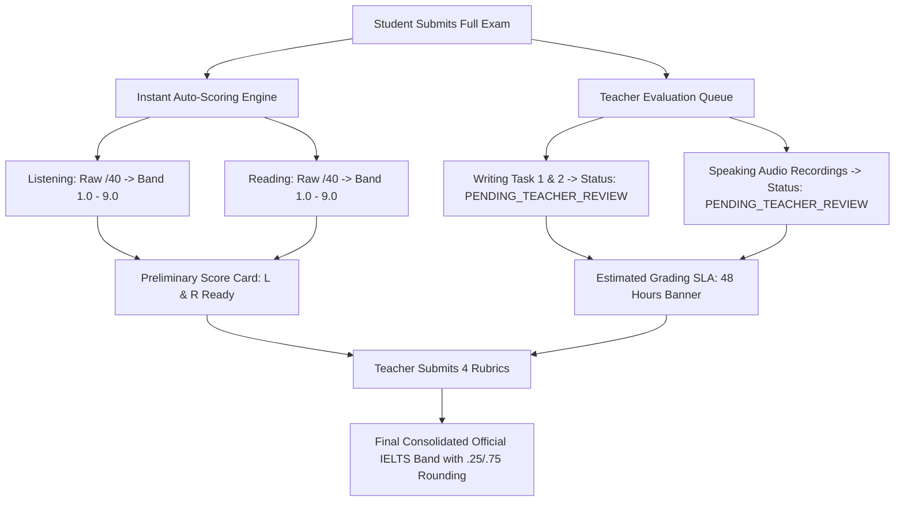

# PRD — IELTS CBT Exam Runner & Center Business Engine

## 1. Executive Summary & Constraints

### 1.1 Core Objective

Deliver a **commercial-grade, schema-driven Computer-Based Testing (CBT) Exam Runner** simulating official British Council / IDP IELTS test-day conditions for IELTS Hồ Thành students, while embedding real center business workflows (Strict vs Practice modes, dual instant/teacher grading, official IELTS rounding, and anti-cheating guardrails).

### 1.2 🚨 Hard Constraint: 100% Frontend UI/UX — Zero Backend Code

- **No backend or server-side code is to be implemented** for this phase.
- All data flows rely on **TypeScript interfaces (`FullIeltsExamManifest`)**, mock data fallbacks, Zustand client state, and browser Web APIs (`localStorage`, `HTMLAudioElement`, `MediaRecorder`, `visibilityState`).
- When the backend is ready, the frontend integrates seamlessly through existing `// 🔌 WIRE:` service points in `src/features/exam-runner/services/ieltsExamService.ts`.

---

## 2. Personas & User Journeys

| Persona                                   | Role & Needs                                                                            | Pain Point / Mental Model                                                                                        |
| ----------------------------------------- | --------------------------------------------------------------------------------------- | ---------------------------------------------------------------------------------------------------------------- |
| **Linh (Student / Test-Taker)**           | High school senior aiming for 7.0 to study abroad. Taking full mock tests and homework. | Panics when layouts shift or audio buffers; needs instant clarity on word count and remaining time.              |
| **Thầy Thành (Center Academic Director)** | Sets center testing policy, placement benchmarks, and midterm exam schedules.           | Demands official IELTS band rounding (.25/.75 rules) and prevents students from copying essays or tab-switching. |
| **Cô Mai (IELTS Examiner / Teacher)**     | Evaluates Writing Task 1/2 and Speaking Part 1–3 submissions.                           | Needs clear 4-criteria rubric grading breakdown (TA/TR, CC, LR, GRA) with inline error highlights.               |

---

## 3. Real Business Rules & Requirements Matrix

### 3.1 Mode Selection: Strict Exam Mode vs. Practice Mode

| Feature / Dimension          | Strict Exam Mode (Chế độ Thi Thật)                                                                    | Practice Mode (Chế độ Luyện Tập)                                        |
| ---------------------------- | ----------------------------------------------------------------------------------------------------- | ----------------------------------------------------------------------- |
| **Target Use Case**          | Midterm / Final Exams, Official Mock Tests, Diagnostic Placement.                                     | Daily homework, self-study, section drill.                              |
| **Audio Player (Listening)** | Continuous playback. **Pause button disabled/hidden**. Audio scrubber disabled. Volume slider active. | Full playback controls: Play, Pause, 10s Rewind/Forward, Scrubbing bar. |
| **Timer & Countdown**        | Unpauseable 2h45m countdown (or skill timer). On `00:00`, auto-submits instantly.                     | Count-up or unconstrained timer; pauseable study session.               |
| **Answer Reveal**            | Answers hidden until official submission & teacher review.                                            | "Kiểm tra đáp án" (Instant check) button available per question.        |
| **Anti-Cheating Guardrails** | Fullscreen recommendation, tab blur detection, copy/paste lock in Writing.                            | No restrictions; free copy/paste and tab navigation.                    |

### 3.2 Dual Scoring Flow & Teacher Evaluation SLA

IELTS tests consist of two distinct grading paradigms that the UI must represent clearly:



1. **Instant Skills (Listening & Reading)**:
   - Evaluated immediately upon submission.
   - Raw score out of 40 mapped to Academic IELTS Band (e.g. 30/40 = 7.0, 35/40 = 8.0).
2. **Teacher-Evaluated Skills (Writing & Speaking)**:
   - Initial UI status: `<span className="badge badge-amber">Chờ chấm điểm (SLA 48h)</span>`.
   - Teacher Review UI displays 4 official criteria sliders/badges (Band 1.0 – 9.0):
     - **Writing**: Task Achievement / Task Response, Coherence & Cohesion, Lexical Resource, Grammatical Range & Accuracy.
     - **Speaking**: Fluency & Coherence, Lexical Resource, Grammatical Range & Accuracy, Pronunciation.
3. **Mock Teacher Review Mode**:
   - The UI includes mock graded states so students and stakeholders can preview both "Pending Review" and "Graded with Examiner Notes" screens.

### 3.3 Official IELTS Band Score Rounding Algorithm

The UI must implement the exact Cambridge / IDP IELTS overall band rounding formula:

$$\text{Average} = \frac{\text{Listening} + \text{Reading} + \text{Writing} + \text{Speaking}}{4}$$

- **Fraction $< .125$** $\rightarrow$ Round **DOWN** to next $.0$ (e.g., $6.125 \rightarrow 6.0$).
- **Fraction $\ge .125$ and $< .25$** $\rightarrow$ Round to $.0$ or $.5$ by standard distance.
- **Fraction $\ge .25$ and $< .625$** $\rightarrow$ Round **UP** to $.5$ (e.g., $6.25 \rightarrow 6.5$; $6.375 \rightarrow 6.5$).
- **Fraction $\ge .625$ and $< .75$** $\rightarrow$ Round **DOWN** to $.5$ (e.g., $6.625 \rightarrow 6.5$).
- **Fraction $\ge .75$** $\rightarrow$ Round **UP** to next whole band (e.g., $6.75 \rightarrow 7.0$).

### 3.4 Client-Side Integrity & Anti-Cheating Guardrails (UI-Enforced)

1. **Anti-Paste on Writing Textareas (Strict Mode)**:
   - Intercept `onPaste`. If detected, reject pasted content and trigger warning toast:
     > _"Chế độ Thi Thật: Vui lòng tự gõ bài thi. Tính năng dán văn bản bị khóa để bảo đảm tính trung thực."_
2. **Text Copy Protection on Reading Passages**:
   - Intercept `onCopy` on passage containers to prevent copying exam texts into external translation tools.
   - Internal in-app yellow/green highlighter remains fully functional.
3. **Tab-Switching / Blur Counter**:
   - Listen to `document.addEventListener('visibilitychange')` and `window.addEventListener('blur')`.
   - Increment `tabSwitchCount` in test state.
   - Display a warning badge: `⚠️ Cảnh báo chuyển tab: 1/3`.
   - On 3rd blur, display confirmation modal without kicking user out, recording violation in submission payload.

### 3.5 Attempt Types & Access Control

1. **Placement / Diagnostic Test**:
   - Single-attempt limit.
   - Upon completion, displays "Bài thi đã nộp cho bộ phận học vụ. Tư vấn viên sẽ liên hệ phân lớp."
2. **Class Homework / Practice**:
   - Unlimited retakes.
   - Features attempt history selector: `Lần làm bài 1 (6.0)`, `Lần làm bài 2 (6.5)`, `Lần làm bài 3 (7.5)`.
3. **Midterm & Final Examination**:
   - Time-windowed banner (e.g. _Thời gian mở đề: 19:00 - 22:00 Chủ Nhật_).
   - Once started, timer runs continuously.

---

## 4. UI/UX Component Specifications

### 4.1 Global CBT Runner Header

- **Exam Title & Badge**: `IELTS Simulation Test - Cam 18 Academic Test 1` + Mode pill (`Chế độ Thi Thật` / `Luyện tập`).
- **Skill Tabs**: Listening, Reading, Writing, Speaking with answered question counter (`32/40`, `40/40`, `2/2`, `3/3`).
- **Global Countdown Timer**: Styled with `font-mono`, changing to warning red when under 5 minutes.
- **Integrity Indicator**: Minimalist `Tab: 0` badge.
- **Submit Action**: Primary button triggering confirmation modal showing summary of answered vs unanswered questions.

### 4.2 Listening Runner (`ListeningRunner.tsx`)

- **Section Card Audio Embed**: Audio player is nested directly within the Section Header Card inside `<div class="mx-auto max-w-3xl space-y-5">`.
- **Section Quick-Tabs**: Section 1 through 4 with live answered indicators (`10/10`).
- **Supported Question Formats**:
  - Form / Note Completion (text input with character limit).
  - Multiple Choice (Single answer radio, Multi-answer checkbox).
  - Matching / Labelling.

### 4.3 Reading Runner (`ReadingPassageView.tsx`)

- **Dual-Pane Split Layout**: Resizable left (Passage) and right (Questions) panels using `react-resizable-panels`.
- **Floating Text Highlighter**:
  - Triggers on mouse selection.
  - Options: Yellow Highlight, Emerald Highlight, Remove Highlight, Add Sticky Note.
- **Question Types**:
  - True / False / Not Given (3-state segmented control).
  - Yes / No / Not Given.
  - Matching Headings (dropdown or drag-and-drop slots).
  - Summary Completion with Word Bank.

### 4.4 Writing Runner (`WritingRunner.tsx`)

- **Dual-Pane Split**: Task prompt & visual chart on left; candidate essay editor on right.
- **Task 1**: Minimum 150 words. Embedded SVG/Image charts (Bar chart, Line graph, Pie chart, Process diagram).
- **Task 2**: Minimum 250 words. Discursive essay prompt.
- **Live Word Counter**:
  - Sub-minimum: `text-slate-500` (`112 / 150 từ - Còn thiếu 38 từ`).
  - Reached target: `text-emerald-600 font-bold` (`165 / 150 từ - Đạt yêu cầu`).
- **Strict Anti-Paste Guard**: Active when in Strict Mode.

### 4.5 Speaking Runner (`SpeakingRunner.tsx`)

- **Part 1**: Introduction & Interview (Audio prompts + question cards).
- **Part 2**: Cue Card Topic with:
  - **60s Preparation Timer** with audible start/stop chime.
  - **Digital Scratchpad** for candidate note-taking.
  - **2-minute Speech Recording** via native browser `MediaRecorder` API.
- **Part 3**: Two-way In-depth Discussion.
- **Audio Visualizer**: Live decibel/recording indicator indicating microphone activity.

### 4.6 Bottom Palette & Navigation (`ExamBottomPalette.tsx`)

- Grid of 40 questions with distinct status states:
  - `Answered`: Dark fill (`bg-slate-900 text-white`).
  - `Flagged for Review`: Purple outline with ribbon flag icon.
  - `Unanswered`: Subtle slate border (`border-slate-200 text-slate-600`).
  - `Active / Current`: Red ring highlight (`ring-2 ring-red-600`).

---

## 5. State Machine & Schema Definition

### 5.1 Submission State Lifecycle

```ts
export type ExamSubmissionStatus =
  | 'IN_PROGRESS' // Candidate is currently taking the test
  | 'SUBMITTED_PENDING_REVIEW' // L&R auto-scored; W&S queued for teacher review
  | 'GRADING_IN_PROGRESS' // Teacher has opened the evaluation rubric
  | 'GRADED_PUBLISHED' // Final official overall band released to student
```

### 5.2 Teacher Evaluation Rubric Structure (UI-facing)

```ts
export interface TeacherRubricAssessment {
  teacherId: string
  teacherName: string
  teacherAvatarUrl?: string
  gradedAt: string
  writingTask1?: {
    taskAchievement: number // 1.0 - 9.0
    coherenceCohesion: number
    lexicalResource: number
    grammaticalRangeAccuracy: number
    overallTask1: number
    feedbackComments: string
  }
  writingTask2?: {
    taskResponse: number
    coherenceCohesion: number
    lexicalResource: number
    grammaticalRangeAccuracy: number
    overallTask2: number
    feedbackComments: string
  }
  speaking?: {
    fluencyCoherence: number
    lexicalResource: number
    grammaticalRangeAccuracy: number
    pronunciation: number
    overallSpeaking: number
    audioFeedbackUrl?: string
    examinerNotes: string
  }
}
```

---

## 6. Non-Functional Criteria & Quality Standards

1. **Zero Pixel Shift (0px Shift)**:
   - Switching between Section tabs, Question palette items, and Highlighting states must not cause any sibling or ancestor elements to shift layout.
2. **Memory & Offline Resilience**:
   - All typed text, question radio selections, and active timers are cached in `localStorage` under key `ielts_cbt_full_session_v1`.
   - Browser refresh or unexpected tab closure preserves 100% of candidate inputs.
3. **Audio Capture Reliability**:
   - `MediaRecorder` captures audio mime types supported by the browser (`audio/webm;codecs=opus` with fallback to `audio/mp4`).
   - Blobs are generated cleanly in memory and serializable for backend transmission.
4. **Verification Gate**:
   - `pnpm type-check` (0 errors), `pnpm lint` (0 warnings), `pnpm build` (100% clean production build).

---

## 7. Sign-off & Implementation Checklist

- [x] **Phase 1 (Core Engine)**: Schema-driven 4-skill CBT Runner engine, resizable Reading split, Listening Section-card audio integration, Writing word counter, Speaking MediaRecorder, and Mock Cambridge 18 exam manifest.
- [ ] **Phase 2 (Business Rules & Integrity UI)**:
  - [ ] Add Mode Switcher modal / toggle (`Chế độ Thi Thật` vs `Chế độ Luyện Tập`).
  - [ ] Implement Anti-Paste in Writing textarea and Tab-Switch Tracker (`visibilitychange`).
  - [ ] Implement Dual-Status Score Card (`L & R Auto-Scored` + `W & S Pending Teacher Review with 48h SLA Banner`).
  - [ ] Implement Teacher Evaluation Rubric Modal (viewing TA/TR, CC, LR, GRA breakdowns & comments).
